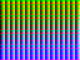

# Test streams (GStreamer command-line cheat sheet)

### Display a test pattern

```
gst-launch-1.0 videotestsrc ! videoconvert ! autovideosink
```

This should display the test pattern in a window, that looks a
bit like this:


There are multiple test patterns available, such as:

| Pattern        | Example           |
| ------------- |:-------------:|
| `videotestsrc pattern=snow`  |  |
| `videotestsrc pattern=red` (and blue, green, white and black) |  |
| `videotestsrc pattern=pinwheel` |  |
| `videotestsrc pattern=smpte100` (color test bars) |  |
| `videotestsrc pattern=colors` |  |

For the full list of patterns, see https://gstreamer.freedesktop.org/data/doc/gstreamer/head/gst-plugins-base-plugins/html/gst-plugins-base-plugins-videotestsrc.html

### Change the shape of a test pattern

To change the width and/or height, pass width and height immediately afterwards, e.g.

```
gst-launch-1.0 -v videotestsrc pattern=snow ! video/x-raw,width=1280,height=720 ! autovideosink
```

### Listen to a test audio (beep)

```
gst-launch-1.0 audiotestsrc ! audioconvert ! autoaudiosink
```

### View test pattern and hear test audio

Combine both the test pattern and test audio:

```
gst-launch-1.0 audiotestsrc ! autoaudiosink videotestsrc ! autovideosink
```
